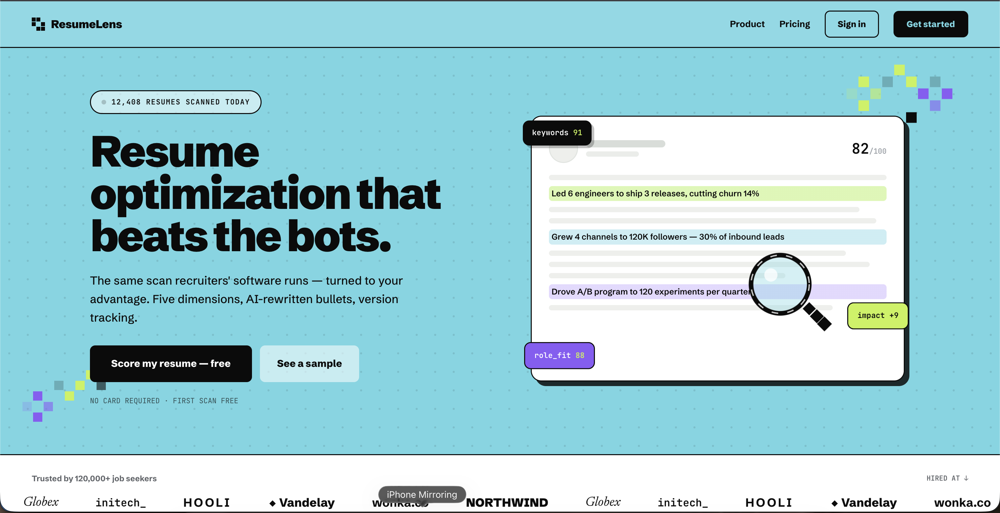

# ResumeLens



**Live demo:** [resume-analyzer-beta-mauve.vercel.app](https://resume-analyzer-beta-mauve.vercel.app/)

Score any resume against a specific job posting. Upload a PDF or DOCX, paste the
job description, and get an AI analysis across five dimensions — ATS
compatibility, tone & style, content, structure, and skills — plus keyword gaps,
concrete rewrite suggestions, and likely interview questions.

Built with React Router 7 (SSR), Zustand, and framer-motion, on top of
[Puter](https://puter.com) for auth, file storage, key-value storage, and the
Claude-powered AI calls (no backend of your own to run).

## How it works

1. **Upload** — drop a PDF/DOCX and describe the target role (`/upload`).
2. **Analyze** — text is extracted client-side so a resume can be scored without
   the slower vision model; if extraction fails it falls back to converting the
   document to an image. Results stream in dimension by dimension.
3. **Report** — a full breakdown at `/resume/:id`, saved to your Puter storage.
   Re-analyze against a different job posting any time; every run is tracked in
   your score history (`/history`).

## Tech stack

- **React Router 7** — routing + server-side rendering
- **Zustand** — single store wrapping the Puter SDK (`app/lib/puter.ts`)
- **framer-motion** — page transitions and reveals
- **pdfjs-dist** / **mammoth** — PDF & DOCX text extraction
- **Tailwind CSS 4** + a custom "Pixel Grotesk" design system (`app/app.css`)
- **Puter** — auth, `fs`, `kv`, and `ai.chat` (Claude Sonnet)

## Development

```bash
npm install
npm run dev        # http://localhost:5173
```

Puter loads from `https://js.puter.com/v2/` at runtime (see `app/root.tsx`), so
no API keys are required for local development.

## Scripts

| Command             | Description                        |
| ------------------- | ---------------------------------- |
| `npm run dev`       | Start the dev server with HMR      |
| `npm run build`     | Production build                   |
| `npm run start`     | Serve the production build         |
| `npm run typecheck` | Generate route types and run `tsc` |

## Building for production

```bash
npm run build
npm run start
```

A `Dockerfile` is included for container deployment (Fly.io, Cloud Run, Railway,
etc.); the built-in server serves `./build/server/index.js`.

## Routes

| Path          | Purpose                                  |
| ------------- | ---------------------------------------- |
| `/`           | Home (marketing landing when signed out) |
| `/upload`     | Upload a resume + job description        |
| `/resume/:id` | Full analysis report                     |
| `/history`    | Score history across analyses            |
| `/settings`   | Account settings                         |
| `/pricing`    | Pricing tiers                            |
| `/wipe`       | Delete all stored files + KV data        |

</content>
